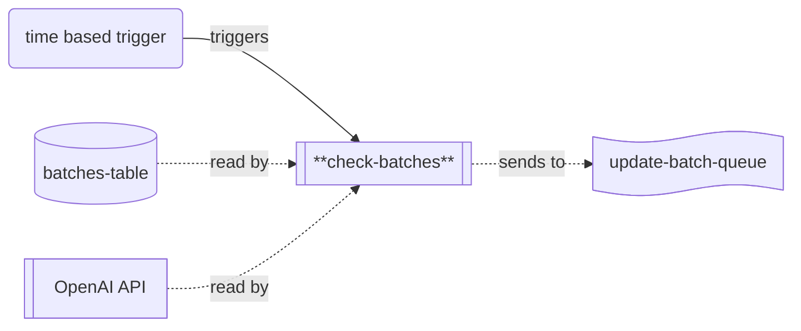

# check-batches

## Description

This repo contains the source code for the `check-batches` lambda, which is part of the Word List application's backend processing chain for updating word scores.



When the `check-batches` lambda runs, it fetches details of the LLM batches waiting for completion from the `batches-table`.  For any batch which is found to be complete, a message will be sent to the target queue to update that specific batch.

## Environment Variables

The lambda uses the following environment variables:

| Variable Name      | Description                                              |
|--------------------|----------------------------------------------------------|
| BATCHES_TABLE_NAME | Name of the table batch information is stored in.        |
| OPENAI_API_KEY     | API key for accessing the OpenAI API.                    |
| OPENAI_MODEL_NAME  | Name of the OpenAI model being used.                     |
| UPDATE_BATCH_QUEUE_NAME | Name of the batch to send update batch messages to. |

## Common Packages

This project uses the `WordList.Common` shared library (in the `lib-common` repository) which is published on GitHub.  To be able to import it, you'll need to use the following command:

```
dotnet nuget add source --username <your-username> --password <github-PAT> --store-password-in-clear-text --name github "https://nuget.pkg.github.com/word-list/index.json"
```